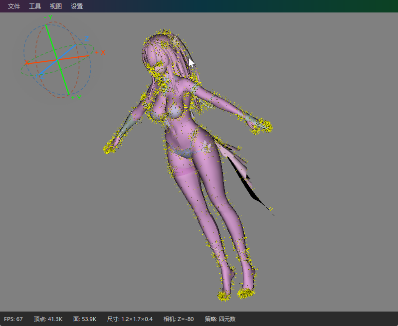
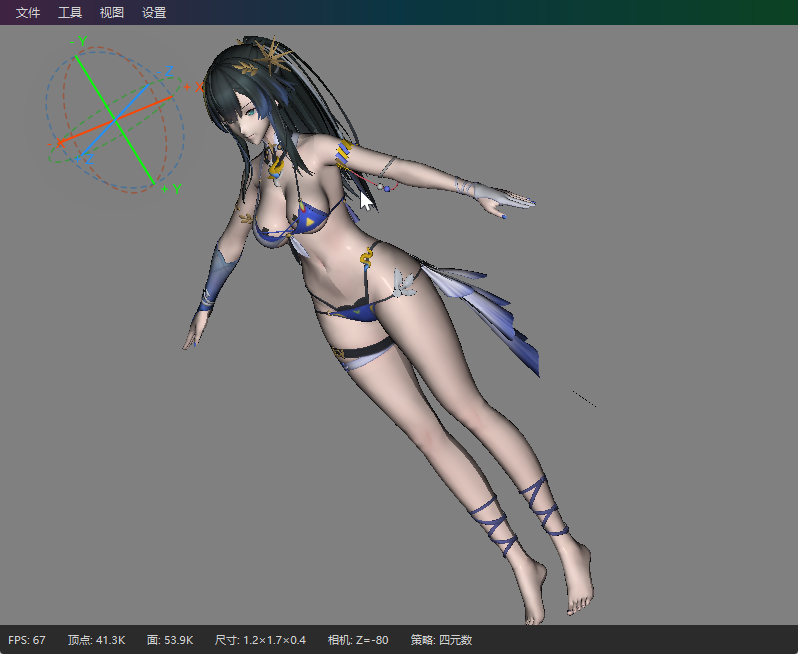
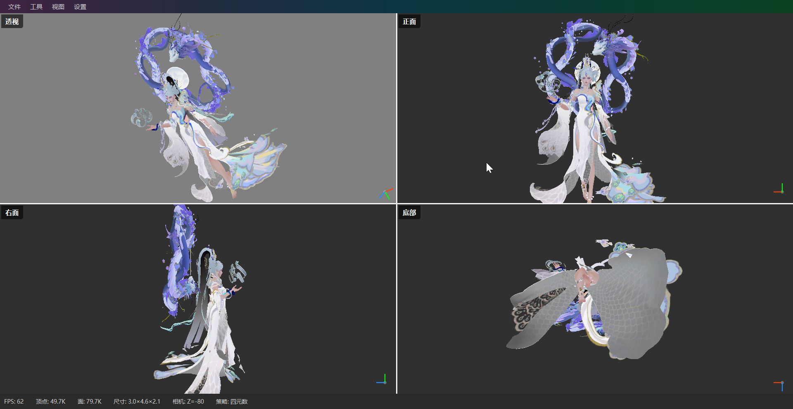

# FX3DView

<div align="center">

**基于 JavaFX 的 3D 模型查看器**

支持四元数/矩阵双旋转后端 · OBJ 模型加载 · 多视口 · 点云渲染 · 丰富的可视化功能

[](https://jdk.java.net/25/)
[](https://openjfx.io/)
[](https://maven.apache.org/)
[](LICENSE)

</div>

---

## 📖 简介

FX3DView 是一个使用 **JavaFX 3D** 构建的桌面端 3D 模型查看器。它采用**策略模式**实现了两套独立的旋转算法后端：

- **四元数旋转**（推荐）：使用四元数 + NLERP 插值，无万向节锁，旋转流畅自然
- **矩阵旋转**（教学对比）：使用 3×3 旋转矩阵 + lerp 插值，可用于理解矩阵旋转的数学原理

通过直观的 UI 和丰富的快捷键，你可以快速预览、旋转、缩放 OBJ 模型，并切换多种渲染模式。









## ✨ 功能特性

### 🎮 交互

- **ArcBall 旋转**：鼠标左键拖拽旋转模型，支持 Ctrl/Shift 修饰键调速
- **平移**：鼠标右键拖拽平移视角
- **缩放**：滚轮缩放
- **拾取**：点击选中模型部件
- **自动旋转**：Space 键触发，模型自动绕固定轴旋转
- **随机旋转**：R 键随机切换视角
- **预设视角**：菜单一键切换到前/后/左/右/上/下六个标准视角

### 🖥️ 多视口
- 按 **M 键**在单视口和四视口（2×2 GridPane）之间切换
- 视口 0（左上）：主透视相机
- 视口 1–3（右上、左下、右下）：独立相机，分别对应前、右、底视角
- 每个视口右下角有小型的迷你轴指示器

### 🎨 着色 / 渲染模式
- **贴图模式**：带纹理贴图的完整渲染
- **纯色模式**：单色渲染
- **线框模式**：仅显示三角网格边线
- **线框叠加**：在贴图上叠加线框
- **法线可视化**：用颜色编码表面法线方向

### ☁️ 点云渲染
- 从模型表面采样生成点云
- 使用 Billboard 技术，每个采样点始终面朝相机
- 采样上限 100,000 点，~60fps 实时刷新

### 💡 光照
- 环境光 + 可开关的方向光
- 打开光源控制对话框调整光照参数

### 📸 其他
- **截图**：菜单一键导出当前视图为 PNG
- **拖放加载**：直接将 .obj 文件拖入窗口即可加载
- **模型信息面板**：显示面数、顶点数等统计信息
- **包围盒**：可切换显示模型的轴对齐包围盒
- **法线显示**：可切换显示顶点法线
- **背面剔除**：可切换背面剔除
- **正交投影**：支持透视 / 正交投影切换
- **Windows 暗色模式**：通过 JNA 调用 DWM API 实现原生标题栏沉浸式暗色模式 + 圆角
- **明/暗主题**：菜单一键切换整体 UI 主题

## ⌨️ 快捷键

| 快捷键 | 功能 |
|--------|------|
| **鼠标左键拖拽** | ArcBall 旋转 |
| **鼠标右键拖拽** | 平移视角 |
| **滚轮** | 缩放 |
| **Z** | 重置视角 |
| **X** | 切换坐标轴可见性 |
| **V** | 切换模型显隐 |
| **Space** | 自动旋转 |
| **R** | 随机旋转 |
| **M** | 切换多视口（单视口 ↔ 四视口） |

## 🛠️ 技术栈

| 技术 | 版本 | 说明 |
|------|------|------|
| Java | 25 | 运行环境 |
| JavaFX | 25.0.3 | 3D 渲染 + UI 框架 |
| Maven | 3.9+ | 项目构建 |
| Lombok | 1.18.46 | 简化样板代码 |
| SLF4J + Logback | 2.0.9 / 1.4.14 | 日志框架 |
| JNA | 5.17.0 | Windows 原生暗色标题栏 |

## 🚀 快速开始

### 环境要求
- **JDK 25**（含 JavaFX 25.0.3）
- **Maven 3.9+**

### 编译与运行

```bash
# 克隆仓库
git clone https://github.com/bingbaihanji/FX3DView-version4.0.git
cd FX3DView-version4.0

# 编译
mvn compile

# 直接通过 Maven 运行
mvn javafx:run

# 打包 fat JAR（输出到 bin/ 目录）
mvn package

# 运行打包后的 JAR
java -jar bin/FX3DView-4.0-SNAPSHOT.jar
```

### 使用方式

1. 启动应用后，通过 **文件 → 导入3D模型** 选择 .obj 文件
2. 或直接将 .obj 文件**拖放**到应用窗口中
3. 使用鼠标和快捷键对模型进行旋转、缩放、平移等操作

## 📁 项目结构

```
src/main/java/com/bingbaihanji/
├── StartMain.java              # 应用主入口
├── WindowsThemeJavaFXApp.java  # Windows 暗色标题栏基类
├── animation/                  # 动画（自动旋转）
│   └── AutoRotationAnimation.java
├── app/                        # 应用核心
│   ├── Fx3DViewerApp.java      # 主应用类（装配所有组件）
│   ├── ViewerComponents.java   # 组件聚合容器
│   ├── QuaternionViewerLauncher.java
│   └── MatrixViewerLauncher.java
├── camera/                     # 相机系统
│   ├── CameraSystem.java       # 三层 GroupTransform 相机
│   ├── CameraConfig.java       # 相机参数配置
│   └── ViewPreset.java         # 预设视角枚举
├── core/                       # 核心接口
│   └── Lifecycle.java          # 生命周期管理
├── interaction/                # 交互处理
│   ├── MouseInteraction.java   # 鼠标事件
│   ├── KeyboardInteraction.java # 键盘快捷键
│   ├── DragDropHandler.java    # 拖放加载
│   ├── PickingController.java  # 拾取
│   └── InteractionConfig.java  # 交互参数配置
├── lighting/                   # 光照管理
│   └── LightManager.java
├── loading/                    # 模型加载
│   ├── ObjImporter.java        # OBJ 解析器
│   ├── ImporterRegistry.java   # 导入器注册表
│   ├── MtlReader.java          # MTL 材质读取
│   ├── Model3D.java            # 模型数据
│   ├── PolygonMesh.java        # 多边形网格
│   └── ...
├── matrix/                     # 矩阵数学库
│   ├── Matrix3.java            # 3×3 旋转矩阵
│   ├── Vector3.java            # 3D 向量
│   ├── ArcBall.java            # ArcBall 算法
│   └── ArcBallUtils.java
├── menu/                       # 菜单系统
│   ├── MenuEvent.java          # 菜单事件处理
│   ├── MenuNode.java           # 菜单节点
│   ├── ShadingHandler.java     # 着色模式
│   └── PointCloudHandler.java  # 点云处理
├── quaternion/                 # 四元数数学库
│   ├── Quaternion.java         # 四元数
│   ├── QuaternionArcBall.java  # 四元数 ArcBall
│   └── QuaternionArcBallUtils.java
├── rotation/                   # 旋转策略
│   ├── RotationStrategy.java   # 策略接口
│   ├── QuaternionRotation.java # 四元数实现
│   └── MatrixRotation.java     # 矩阵实现
├── scene/                      # 场景图
│   ├── Scene3DManager.java     # 场景管理
│   ├── AxesBuilder.java        # 坐标轴构建
│   ├── BoundingBoxRenderer.java # 包围盒渲染
│   ├── NormalVisualizer.java   # 法线可视化
│   └── PointCloudBuilder.java  # 点云构建
├── ui/                         # UI 组件
│   ├── MainLayout.java         # 主布局
│   ├── MultiViewportLayout.java # 多视口布局
│   ├── StatusBar.java          # 状态栏
│   └── ModelInfoPanel.java     # 模型信息面板
├── view/                       # 视图辅助
│   ├── ViewingAxes.java        # 视角指示轴
│   ├── MiniAxes.java           # 迷你轴
│   └── BackgroundColorPicker.java
└── world/                      # 世界变换
    └── GroupTransform.java     # 通用变换组
```

## 🏗️ 架构设计

### 策略模式 — 旋转后端

```
RotationStrategy (接口)
    ├── QuaternionRotation  (四元数 + NLERP，推荐)
    └── MatrixRotation      (3×3 矩阵 + lerp，教学对比)
```

启动时通过 `QuaternionViewerLauncher` 或 `MatrixViewerLauncher` 注入不同的 `RotationStrategy` 实现。所有共享逻辑位于 `Fx3DViewerApp` 中，策略只是委托给数学原语层的薄适配器。

### 相机层次结构

```
root → world → (axisGroup, moleculeGroup)
                ↑
           CameraSystem (三层 GroupTransform)
                ├── 旋转层 (由 RotationStrategy 驱动)
                ├── 平移层
                └── 相机层 (PerspectiveCamera)
```

### 模型加载管线

```
.obj 文件 → ObjImporter 解析 → TriangleMesh / PolygonMesh
    → MeshView / PolygonMeshView → moleculeGroup (场景图)
```

拖放和菜单导入均通过 `ImporterRegistry` 按扩展名动态获取导入器，新增格式只需注册新的 `Importer` 实现。

## 📝 日志

日志输出到 `logs/` 目录，按级别分离（INFO / WARN / ERROR），自动按 7 天滚动保留。配置文件：`src/main/resources/logback.xml`

## 🤝 贡献

欢迎提交 Issue 和 Pull Request。

## 📄 许可证

MIT License

---

<div align="center">
Made with ❤️ by <a href="https://github.com/bingbaihanji">冰白寒祭</a>
</div>
